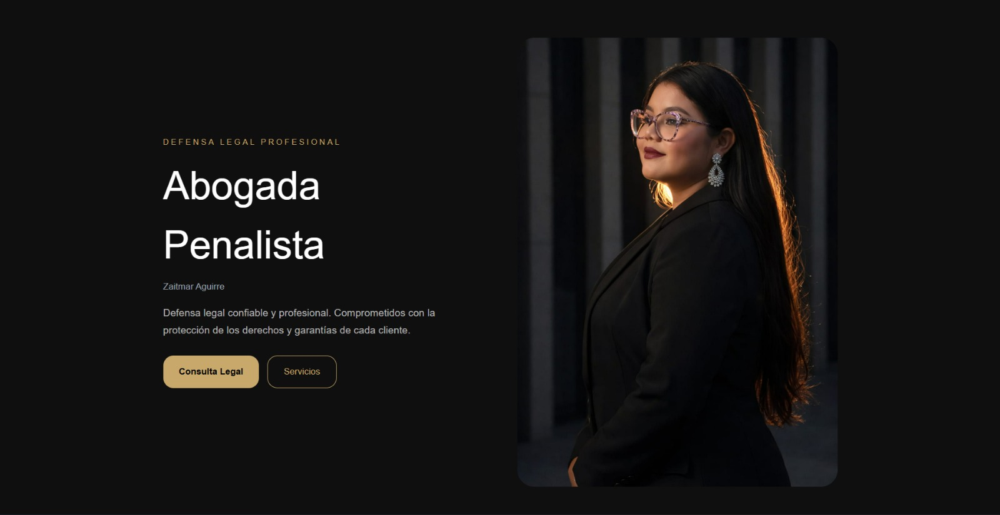

# ⚖️ Lawyer Portfolio Website

**Developed by Chriss_MK**

A modern, responsive and animated portfolio website for a professional criminal defense lawyer.  
Built with React and Framer Motion, this project focuses on clean UI/UX design, performance, and professional presentation.

---

## 📸 Project Preview

---

## 👨‍💻 Developer

**Chriss_MK**  
Frontend Developer | React Enthusiast | UI/UX Learner

---

## 🚀 Live Preview

> (Add your Vercel or deployment link here)

Example:
https://lawyer-portfolio.vercel.app

---

## 🧰 Technologies Used

- React.js
- Vite
- Framer Motion
- CSS3
- JavaScript (ES6+)

---

## ✨ Features

- 🎨 Modern dark-themed UI design
- 📱 Fully responsive layout (mobile, tablet, desktop)
- ⚡ Smooth scroll animations using Framer Motion
- 🧑‍⚖️ Professional hero section with lawyer branding
- 🧾 Services section with professional icon system
- 📞 Contact section with location, phone, and email
- 🧠 Clean and maintainable code structure
- 🚀 Fast performance with Vite

---

## 📸 Project Preview

---

## 📂 Project Structure
